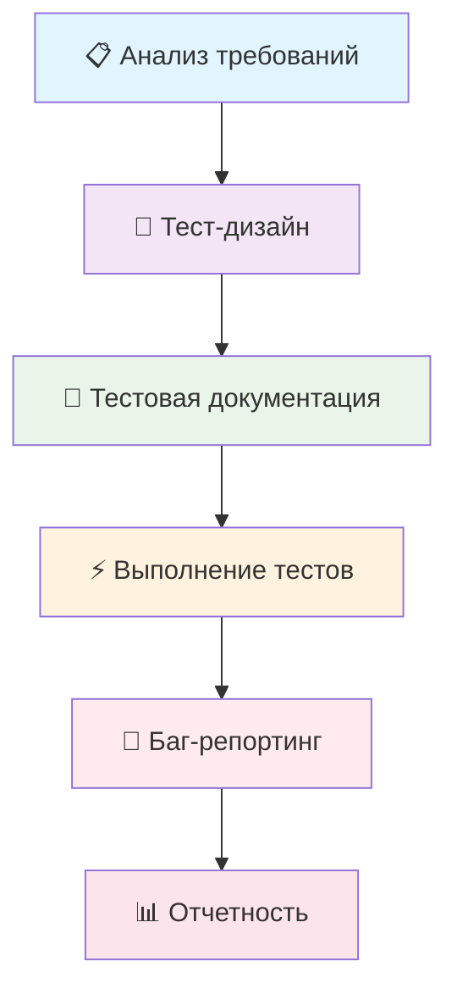

# 🛒 Тестирование интернет-магазина 

## 📋 О проекте
Комплексное тестирование веб-приложения интернет-магазина с полным циклом QA процессов.

## 🎯 Демонстрируемые навыки
- Анализ требований и тест-анализ
- Применение техник тест-дизайна
- Создание тестовой документации
- Баг-репортинг и работа с Jira
## 🛠️ Технологии и инструменты

      

## 📊 Ключевые результаты
- ✅ Протестировано 8 пользовательских историй
- ✅ Проведено исследовательское тестирования корзины без требований с использованием Chrome DevTools
- ✅ Созданы Чек-лист на 28 проверок и 10 тест-кейсов
- ✅ Выявлено 13 дефектов различной критичности
- ✅ Применено 3 техники тест-дизайна

## 🔗 Ресурсы проекта
- [🌐 Тестируемое приложение](https://intern.demoshopping.ru/)
- [🎨 Макет в Figma](https://www.figma.com/design/2T99Jt5OHPqkhe4yyoe2IC/demoshopping.ru)
- 📋 [Пользовательские истории](https://drive.google.com/drive/u/0/folders/1WoDjzphTfo0jR8T3uz7IXO1sbawWDLj3)

## 🛠️ Процесс тестирования

### 1. Анализ требований
- [📋 Анализ пользовательских историй] ([ID1: Регистрация](https://rusau.kaiten.ru/p/d/731b641b-545d-4311-a691-c397a21eb1bd)  | [ID2: Вход в систему](https://rusau.kaiten.ru/p/d/1c04eafd-86f6-4a21-85cd-1fbf8d3be706)  |  [ID3: Выход из системы](https://rusau.kaiten.ru/p/d/1f464f17-8de7-4f54-992c-11e9fa5fd646)  |  [ID4: Проверка авторизации перед доступом к функциональности](https://rusau.kaiten.ru/p/d/d440e1db-3645-48f3-8510-686704dcf09c)  |  [ID5: Просмотр списка товаров и деталей продукта](https://rusau.kaiten.ru/p/d/d49f0805-50b2-4b3e-b41c-524c0630b709)  |  [ID6: Добавление товара в корзину](https://rusau.kaiten.ru/p/d/11290aff-1218-44c5-a195-f724931d6615)  |  [ID7: Фильтрация списка товаров](https://rusau.kaiten.ru/p/d/5b275ec1-e6df-47a4-9648-d422f4a387f3)  | [ID8: Сортировка списка товаров](https://rusau.kaiten.ru/p/d/705e06d8-971f-4e0a-b8de-7e13befcc7a3)) .
- [🔍 Review требований модуля "Регистрация"](https://docs.google.com/spreadsheets/d/1Fmmg2QzSSmalWZYOB9aZW2ikfSJL3hHYzs2TSaOgfUs/edit)

### 2. Тест-дизайн
- [📈 Эквивалентное разделение и граничные значения](https://docs.google.com/spreadsheets/d/1-YEKHGCWxJIR_iKejc04RhF7vwXqvD0jr6b4d2_Z5Uo/edit)
- [🔄 Попарное тестирование](https://docs.google.com/spreadsheets/d/1Ca4-97zyEZ3f-KbHVDucD1ComHb9kz2bFkU6uVodEpg/edit)
- [🎯 Таблицы принятия решений](https://docs.google.com/spreadsheets/d/1Rd90Lqeb9HhmPGr5F89_tx_K1Aip8YRLQ3jz_Mbdc94/edit)

### 3. Тестовая документация
- [✅ Чек-лист](https://docs.google.com/spreadsheets/d/1pTvhUeJGzJkCn_m8dVJJqUm6Qwvc4UpfYnqwfhAx9ko/edit)
- [📝 Тест-кейсы в TestIT](https://drive.google.com/file/d/1vsL-YELQ3xZX3CsjGbyDWZeCZn4XSzxe/view)

### 4. Результаты тестирования
- [🐛 13 Баг-репортов в Jira](https://drive.google.com/file/d/1h9RkRBhX1Hl7StTJXHwplM4MMXWC9ftp/view)
- [📊 Матрица соответствия требований](https://docs.google.com/spreadsheets/d/1ReGnK1sFtsbeBhOegeaHaxGcGD4ezzOJaftrRCd3PB0/edit)
